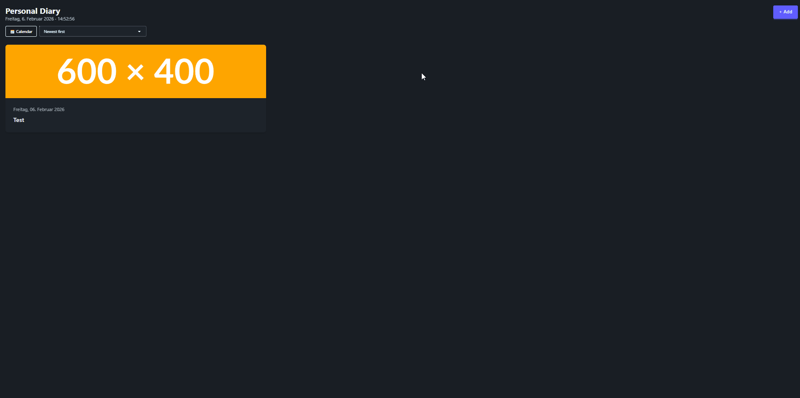

# 📔 Personal Diary

A simple yet feature-rich personal diary application built with **React**, **Vite**, **TailwindCSS**, and **DaisyUI**.  
Users can create, edit, delete, and sort daily diary entries, view them in a clean card-based layout, and open full entries in a modal view.  
All data is persisted locally using the Web Storage API (`localStorage`).

---

## 🚀 Live Demo



👉 _Deployment link will be added after publishing on Render_

---

## 🛠 Tech Stack

- **React** – UI library
- **Vite** – build tool & dev server
- **TailwindCSS** – utility-first styling
- **DaisyUI** – Tailwind component library
- **Web Storage API (localStorage)** – data persistence
- **Render** – static site deployment

---

## ✨ Features

### Core Functionality

- 📅 Create **one diary entry per day**
- 🖼 Entries include **title, date, image URL, and content**
- 🧾 Entries displayed as **responsive cards**
- 🔍 Click a card to open a **detail modal**
- ➕ Add new entries via a modal form
- ✏️ **Edit existing entries** (pre-filled form)
- 🗑 **Delete entries** with confirmation
- 🚫 Prevents multiple entries for the same date
- ✅ Form validation (all fields required)

### Calendar Integration

- 📅 Interactive **monthly calendar modal**
- 🔘 Days with existing diary entries are **visually marked**
- 👆 Clicking a marked day opens the corresponding diary entry
- ➕ Clicking an empty day opens the **add-entry modal** with the selected date
- 🗓 Calendar grid always shows complete weeks (Monday → Sunday)
- 🇩🇪 Dates are handled and displayed in **German format**
- 🕒 Internally uses ISO date strings (`YYYY-MM-DD`) for consistency

### UX Enhancements

- 🕒 **Live date & time** displayed in the header
- 🇩🇪 **German date formatting** for all diary entries
- 🖼 **Automatic placeholder image** if no image URL is provided
- 🔃 **Sorting options**:
  - Newest → Oldest
  - Oldest → Newest
  - Title A–Z
- 💾 Persistent storage using `localStorage`
- 📱 Fully responsive layout

---

## 🧩 Component Structure

```text
src/
├── components/
│   ├── calendar/
│   │   ├── CalendarButton.jsx     # Opens calendar modal
│   │   ├── CalendarModal.jsx      # Monthly calendar modal
│   │   └── CalendarGrid.jsx       # Calendar grid & day logic
│   │
│   ├── entries/
│   │   ├── EntryList.jsx          # Renders sorted diary entries
│   │   └── EntryCard.jsx          # Entry preview card
│   │
│   ├── header/
│   │   ├── Header.jsx             # App title, live date & time, sorting
│   │   └── AddEntryButton.jsx     # Opens add/edit entry modal
│   │
│   └── modals/
│       ├── AddEntryModal.jsx      # Modal wrapper for add/edit
│       ├── EntryForm.jsx          # Controlled form (add & edit)
│       ├── ViewEntryModal.jsx     # Entry detail modal
│       └── EntryDetails.jsx       # Full diary entry display
│
├── App.jsx                        # Global state & business logic
├── main.jsx                       # App entry point
├── index.css                      # TailwindCSS & DaisyUI setup
```
